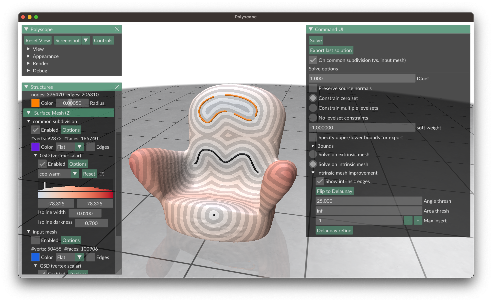
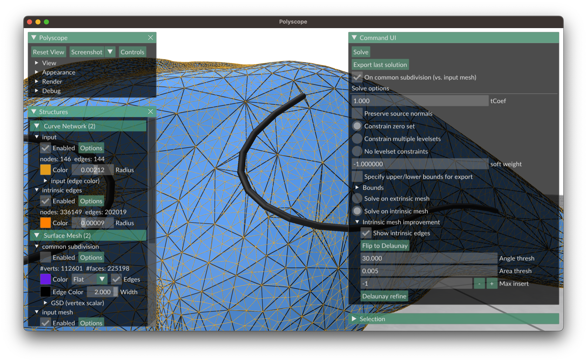
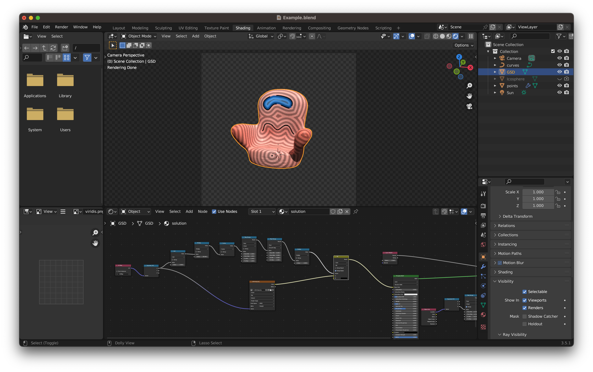

# signed-heat-demo (2D surface domains)

C++ demo for "[A Heat Method for Generalized Signed Distance](https://nzfeng.github.io/research/SignedHeatMethod/index.html)" by [Nicole Feng](https://nzfeng.github.io/index.html) and [Keenan Crane](https://www.cs.cmu.edu/~kmcrane/), presented at SIGGRAPH 2024.

Project page with links to paper, pseudocode, supplementals, & videos: [link](https://nzfeng.github.io/research/SignedHeatMethod/index.html)

This Github repository demonstrates the _Signed Heat Method (SHM)_ on **2D surface domains**, including triangle meshes, polygon meshes, and point clouds. The Signed Heat Method is implemented in [geometry-central](https://geometry-central.net/surface/algorithms/signed_heat_method/), this is just a demo application.

If you're interested in using the Signed Heat Method in 3D volumetric domains, go to [this Github repository](https://github.com/nzfeng/signed-heat-3d).



If this code contributes to academic work, please cite as:
```bibtex
@article{Feng:2024:SHM,
    author = {Feng, Nicole and Crane, Keenan},
    title = {A Heat Method for Generalized Signed Distance},
    year = {2024},
    issue_date = {July 2024},
    publisher = {Association for Computing Machinery},
    address = {New York, NY, USA},
    volume = {43},
    number = {4},
    issn = {0730-0301},
    url = {https://doi.org/10.1145/3658220},
    doi = {10.1145/3658220},
    journal = {ACM Trans. Graph.},
    month = {jul},
    articleno = {92},
    numpages = {19}
}
```

## Getting started

This project depends on [geometry-central](https://geometry-central.net) for mesh computations, and [Polyscope](http://polyscope.run/) for visualization. These dependencies are added as git submodules, so copies will be downloaded locally when you clone this project as below.

```
git clone --recursive https://github.com/nzfeng/signed-heat-demo.git
```

To run the project,
```
cd signed-heat-demo
mkdir build && cd build
cmake -DCMAKE_BUILD_TYPE=Release ..            # use `Debug` instead of `Release` if you want debug mode
make -j8                                       # or however many cores you want to use
bin/main /path/to/mesh --i=/path/to/curve
```
A Polyscope GUI will open.

If you do not clone recursively, some submodules or sub-submodules will not clone. Initialize/update these submodules by running `git submodule update --init --recursive` or `git submodule update --recursive`.

# Input

## Mesh file formats
The input mesh may be an `obj`, `ply`, `off`, or `stl`. See [the geometry-central website](https://geometry-central.net/surface/utilities/io/#reading-meshes) for up-to-date information on supported file types. Point clouds are assumed to have the extension `.pc`.

## Curve/point input

Triangle meshes support both signed & unsigned curve sources, and isolated point sources as input source geometry. Source geometry is specified using a txt file separate from the mesh file. Geometry type is indicated by one of the following strings:
* `signed_curve`
* `unsigned_curve`
* `unsigned_point`
followed by newline-separated values defining the nodes of the curve(s) or point sources. Nodes are _barycentric points_, and may lie on vertices, edges, or faces; each node is defined by a leading character, which can be either `v` (vertex), `e` (edge), `f` (face), followed by the element's index (using the convention of 0-indexing), and the appropriate number of barycentric coordinates.

Alternatively, one can specify curves as [OBJ line elements](https://en.wikipedia.org/wiki/Wavefront_.obj_file#Line_elements). Lines are specified with the leading char `l`, followed by white-space separated vertex indices --- these indices are _1-indexed_, following the OBJ file format convention.

The order in which nodes are listed per curve defines the curve; the curve is defined by an oriented edge between each pair of adjacent nodes. Curves are assumed to consist of at least two nodes.

An input file might look like this:

```
signed_curve
v 1
v 2
v 3
v 4
v 5
v 1
unsigned_curve
v 0
e 5 0.1
v 19
signed_curve
e 55 0.5
e 56 0.73
f 23 0.2 0.3
v 12
unsigned_point
v 1098
signed_curve
l 65 4 88 29 22 14 85 97 6 2 7 77
```

While there can be an arbitrary number of curve segments per face, each curve segment must lie entirely within a face (meaning a single curve segment traversing more than one face should be split into multiple segments). Unsigned curves must be restricted to mesh vertices.

On polygon meshes and point clouds, curve nodes must be restricted to vertices, and unsigned curves and isolated point sources are not supported.

See in the `/input` directory for examples.

_Warning_: The indexing order of vertices, edges, and faces of a given mesh can vary depending on what software was used to create, read, or write the mesh to a file --- and this order may differ from geometry-central's conventions. It is up to the user to ensure that the input source geometry's indexing convention remains consistent with how mesh elements are specified in either the corresponding input mesh file, and/or geometry-central's conventions. For instance, OBJ files determine vertex and face indices, but not edges; if you used software different from geometry-central to determine nodes on edges, these edge indices may not be interpreted the same by geometry-central.

# Usage

In addition to the mesh file, you can pass several arguments to the command line, including some flags which are also shown as options in the GUI.

|flag | purpose|
| ------------- |-------------|
|`--i`, `--input=[name].txt`| Filepath to input curve/points. |
|`--o`, `--output=[name].obj`| File to save signed distance function to. |
|`--V`, `--verbose`| Verbose output. |
|`--h`, `--headless`| Don't use the GUI, and automatically solve for & export the generalized SDF.|
|`--help`| Display help. |

## Intrinsic re-meshing

The GUI can perform intrinsic Delaunay refinement for better numerical behavior. If you choose to solve on an intrinsic mesh, you can either export the solution on the original mesh, using [L2 optimal transfer](http://geometry-central.net/surface/intrinsic_triangulations/function_transfer/#l2-optimal-transfer), or on the [common subdivision](https://geometry-central.net/surface/intrinsic_triangulations/common_subdivision/).



Notes: 
* Only manifold meshes can be intrinsically re-triangulated.
* Curves must be constrained to mesh edges, and point sources constrained to vertices, so that the mesh can be intrinsically refined while preserving the geometry of the input sources.
* Delaunay refinement may not terminate with a minimum angle value >30 degrees. If this happens, I recommend picking an angle value of 25-28 degrees.

# Output

From the GUI menu, you can export the SDF as an OBJ file containing both the mesh and texture coordinates. Whenever one calls an export function, the data that gets exported is from most recently computed solution.

From the GUI menu, you can also export curves as [OBJ line elements](https://en.wikipedia.org/wiki/Wavefront_.obj_file#Line_elements). Note that in most 3D graphics software, how smooth a curve is rendered depends on its connectivity (i.e., there can be noticeable gaps between curves specified as separate segments.) While the order in which you specify curve segments does not affect the results of the signed heat method, I recommend computing connected components of your curve _for visualization only_, so that the curve can be exported with maximum connectivity and hence yield maximum smoothness during rendering. 

I have included an example Blender file that loads in a mesh, and renders SDF stored as texture coordinates on the mesh; see the section on "Visualization" below. The program also outputs a custom colormap as a PPM image whenever you export a solution; you can convert to e.g. PNG using ImageMagick using the command `mogrify -format png *.ppm`.

## Visualization

The `media/` directory contains an example Blender file (`Example.blend`) renders SDFs on the surface along with the source geometry.



*Warning*: By default, solutions will be normalized so that their range (the difference between the minimum and maximum values) is 1. The GUI menu has options to manually specify a lower and upper bounds used for normalization.